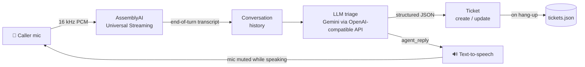

# 🎧 Voice Triage Agent

**A caller describes a support problem out loud. The agent listens in real time, asks the right follow-up questions by voice, and hands back one clean, prioritised support ticket.**

Built for the **AssemblyAI Voice Agent Hackathon** (lablab.ai, September 2026).

---

## The problem

Support calls start messy. Callers pause, ramble, correct themselves, and bury the important detail ("I have a client demo in an hour") at the end. A human agent then has to retype all of it into a ticket, pick a category, and guess a priority.

## What it does

1. **Listens live** – the caller's speech is streamed to AssemblyAI and transcribed as they talk.
2. **Understands the whole call** – every turn is re-read in context, so fragments split by pauses become one issue, and likely speech-to-text errors are corrected from context.
3. **Builds one ticket per call** – category, priority, and a one-line summary, updated as new details arrive.
4. **Asks what's missing, out loud** – one question at a time, never repeating something the caller already said.
5. **Confirms and saves** – when the ticket is complete, the agent confirms it by voice and saves it with the full transcript to `tickets.json`.

## Example call

A real call with the agent (the caller's email has been changed):

```
AGENT:  Hi, you've reached support. Please describe the problem you're facing.
CALLER: Knee pain.
AGENT:  I am sorry, but this line is for software support. Please contact a medical
        professional for assistance with knee pain.

CALLER: I have logged in yesterday's— I have— I can't log in since yesterday's update.
        I have a client demo in an hour.

  TICKET CREATED  [High] Login/Access: Unable to log in following yesterday's update
    ? What error message or behavior occurs when logging in?
    ? What is your username or account email?

AGENT:  I understand you need this fixed urgently for your client demo. Could you please
        provide your username or account email so I can look into this right away?
CALLER: alex.jordan@example.com.

  TICKET UPDATED  [High] Login/Access: Unable to log in since yesterday's update

AGENT:  I have created a high-priority ticket for your login issue. Our support team will
        follow up with you shortly to help get this resolved before your demo.
```

This one call shows the agent:
- **Staying on task:** it redirects an off-topic request politely.
- **Handling messy speech:** it understands a caller who stumbles and restarts.
- **Setting priority from context:** it recognizes the urgency of the client demo and sets High priority.
- **Asking one question at a time:** it asks only for what's missing.
- **Confirming and ending the call:** it closes once the ticket is complete.

Saved ticket:

```json
{
  "id": 1,
  "created_at": "2026-09-23T11:33:43",
  "category": "Login/Access",
  "priority": "High",
  "summary": "Unable to log in following update prior to urgent client demo",
  "missing_info": ["Are you receiving a specific error message when trying to log in?"],
  "transcript": [
    {"role": "Agent",  "text": "Hi, you've reached support. Please describe the problem you're facing."},
    {"role": "Caller", "text": "I can't log in since yesterday's update."},
    {"role": "Caller", "text": "And I have a client demo in an hour."}
  ]
}
```

## How it works



**How AssemblyAI is used**

- **Universal Streaming (v3)** for low-latency live transcription with formatted, punctuated turns.
- **Tuned turn detection** (`end_of_turn_confidence_threshold`, `min_turn_silence`, `max_turn_silence`) so natural mid-sentence pauses don't cut a caller off.
- **Key terms prompting** (`keyterms_prompt`) with support vocabulary like "log in", "billing" and "client demo", which improves accuracy on the words that matter for triage.

**Design decisions**

- **Bring-your-own LLM and TTS** instead of an all-in-one voice API, to control every stage of the pipeline.
- **One call = one ticket.** The LLM re-reads the whole conversation on every turn and updates a single ticket instead of creating one per sentence.
- **Structured outputs** (JSON schema, strict mode), so tickets are always valid, with fixed categories and priorities.
- **Stale-result skipping.** If the caller speaks again while the LLM is working, the older result is discarded.
- **No self-hearing.** The mic sends silence while the agent speaks, and the agent won't talk while the caller is mid-sentence.

## Tech stack

| Layer | Tool |
|---|---|
| Speech-to-text | AssemblyAI Universal Streaming (Python SDK) |
| Triage LLM | Google Gemini via its OpenAI-compatible API (any OpenAI-compatible model works) |
| Text-to-speech | Windows SAPI voices via comtypes (offline, free) |
| Audio | PyAudio |
| Language | Python 3.12 |

## Setup (Windows)

Requires **Python 3.12** (PyAudio has no prebuilt wheel for newer versions yet) and a microphone.

```bash
git clone https://github.com/josephajo-create/voice-triage-agent.git
cd voice-triage-agent

py -V:3.12 -m venv .venv
.venv\Scripts\activate
pip install -r requirements.txt

copy .env.example .env
notepad .env        # add your AssemblyAI and Gemini keys
```

## Usage

```bash
python agent.py     # full voice agent - press Ctrl+C to end the call
```

Quick checks for each component:

```bash
python stream_test.py                                   # mic + speech-to-text only
python triage.py "I was charged twice this month"       # LLM triage only
python tts.py                                           # voice output only
```

## Project structure

```
agent.py          Main voice agent: mic -> STT -> triage -> TTS -> ticket
triage.py         LLM prompt, ticket schema and classification
tts.py            Text-to-speech on a background thread
stream_test.py    Standalone mic + transcription test
.env.example      Configuration template
```

## Ticket fields

| Field | Values |
|---|---|
| `category` | Login/Access, Billing, Bug/Error, Performance, Feature Request, Account Change, Other |
| `priority` | Critical, High, Medium, Low (rules in `triage.py`) |
| `summary` | One-line ticket title |
| `missing_info` | Up to 3 questions still to ask |
| `transcript` | Full call, with Agent and Caller turns |

## Limitations and next steps

- **Barge-in** – the caller can't interrupt the agent yet.
- **Telephony** – connect to a real phone line (e.g. Twilio) instead of a local mic.
- **Helpdesk integration** – push tickets into Jira, Zendesk or Freshdesk.
- **Ticket dashboard** – a live board of incoming tickets.
- **Neural TTS** – more natural voice output.

## Author

Ajo – AssemblyAI Voice Agent Hackathon 2026
